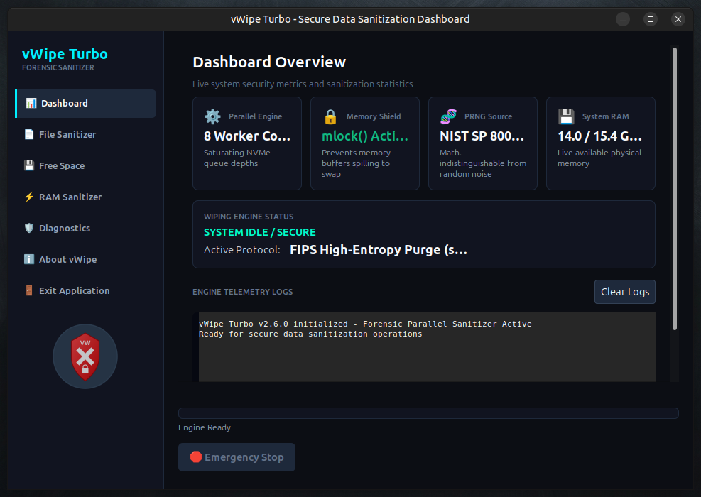

# Virtual Wipe Turbo v2.6.0

[](LICENSE)
[]()
[]()
[]()
[]()
[]()

**Virtual Wipe Turbo** is a high-performance, forensic-grade secure data sanitization suite engineered for maximum speed and uncompromising security. Leveraging a multi-core "Turbo Engine," it saturates modern NVMe and SSD throughput while maintaining full compliance with rigorous international standards.

Built for security professionals, forensic investigators, and privacy-conscious users who demand both speed and mathematical certainty.

---

## 📸 Screenshot

<div align="center">
  
  <br/>
  <em>Forensic-grade data sanitization suite — dark-themed GTK interface with multi-core Turbo Engine</em>
</div>

---

## 🚀 Key Features

- ⚡ **8-Core Turbo-Wipe Engine** — Automatically detects CPU topology and deploys parallel workers to fully saturate storage bandwidth.
- 🛡️ **NIST SP 800-88 Rev. 1 Compliant** — Supports both Baseline (Clear) and Purge schemes used by government and enterprise standards.
- 🧬 **FIPS 140-3 Grade Entropy** — Cryptographically secure PRNGs ensure wiped data is indistinguishable from true random noise (IND-RND).
- 🔒 **RAM Protection** — Sensitive buffers are `mlock()`'ed into physical memory to prevent leakage to swap or hibernation files.
- 🌑 **Premium Dark Interface** — Sophisticated charcoal and teal aesthetic tailored for professional forensic workstations.
- 📁 **Comprehensive Wiping Modes**:
  - **File Wipe** — Secure deletion of individual files
  - **Directory Wipe** — Recursive sanitization with metadata purging
  - **Free Space Wipe** — Multi-threaded cleaning of unallocated sectors
  - **RAM Fill** — Dedicated volatile memory sanitization module

---

## 🛠️ Prerequisites

### Build Dependencies
- `gcc` (C11 + OpenMP/Pthreads support)
- `make`
- `pkg-config`

### Required Libraries
- GTK3 (`gtk+-3.0`)
- GLib 2.0
- Pthreads

**Installation on Ubuntu/Debian:**
```bash
sudo apt update
sudo apt install build-essential libgtk-3-dev pkg-config
```

---

## 🏗️ Installation

```bash
# Build
make clean && make

# Optional system-wide install
sudo make install
```

This installs the `vwipe` binary to `/usr/local/bin` and registers the desktop entry with the official icon.

---

## 📖 Usage

```bash
./vwipe
```

### Available Sanitization Schemes

1. **NIST Clear** — Single-pass zero fill (maximum speed)
2. **DoD 5220.22-M** — Classic 3-pass overwrite
3. **NIST Purge** — 4-pass high-security scheme with verification
4. **FIPS High-Entropy** — 5-pass strongest purge using multiple cryptographically random patterns

---

## ⚖️ Forensic Considerations

On Copy-on-Write filesystems (Btrfs, ZFS, APFS), traditional file-level wiping can be ineffective due to snapshotting and delayed allocation. In such cases, **Free Space Wipe** is strongly recommended to ensure complete data destruction.

---

## 🔄 v2.6.0 Release Highlights

Version 2.6.0 brings significant stability, security, and correctness improvements:

- Enhanced directory metadata purging with parent `fsync()` to guarantee removal of file entries
- Fixed TRIM sequencing to ensure proper SSD wear-leveling cooperation
- Improved thread safety with atomic progress counters and isolated scheme parameters
- Hardened RAM module with corrected `mlock` capability checks and cryptographically seeded passes
- Resolved multiple data race conditions and async-signal safety issues

For the complete changelog, see [UPDATE.md](UPDATE.md).

---

## 📄 License

This project is released under the **MIT License**.

Copyright © 2026 Jean-François Lachance-Caumartin. All rights reserved.

---

*🦑 Part of the Krakken Cryptographic Ecosystem — 2026*
```
