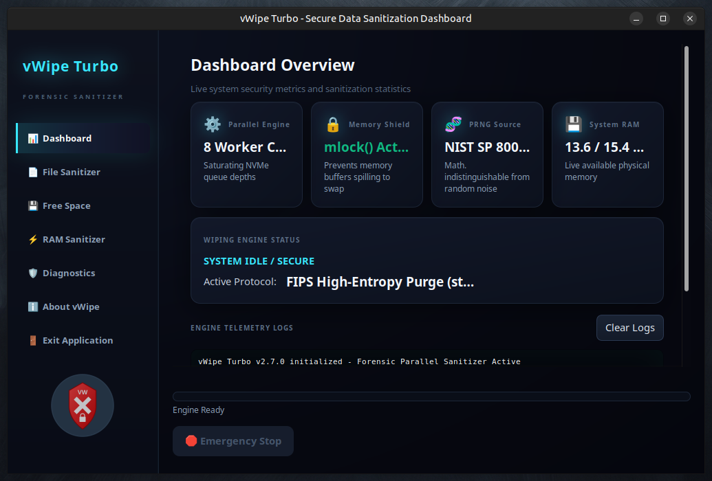

<div align="center">
<h1><a href="https://github.com/effjy/vwipe/"></a></h1>
</div>
<div align="center">

[](LICENSE)
[]()
[]()
[]()
[]()
[]()

</div>

**Virtual Wipe Turbo** is a high-performance, forensic-grade secure data sanitization suite engineered for maximum speed and uncompromising security. Leveraging a multi-core "Turbo Engine," it saturates modern NVMe and SSD throughput while maintaining full compliance with rigorous international standards.

Built for security professionals, forensic investigators, and privacy-conscious users who demand both speed and mathematical certainty. 
---

## 📸 Screenshot

<div align="center">
  
  <br/>
  <em>Forensic-grade data sanitization suite — dark-themed GTK interface with multi-core Turbo Engine</em>
</div>

---

## 🚀 Key Features

- ⚡ **8-Core Turbo-Wipe Engine** — Automatically detects CPU topology and deploys parallel workers to fully saturate storage bandwidth.
- 🛡️ **NIST SP 800-88 Rev. 1 Compliant** — Supports both Baseline (Clear) and Purge schemes used by government and enterprise standards.
- 🧬 **FIPS 140-3 Grade Entropy** — Cryptographically secure PRNGs ensure wiped data is indistinguishable from true random noise (IND-RND).
- 🔒 **RAM Protection** — Sensitive buffers are `mlock()`'ed into physical memory to prevent leakage to swap or hibernation files.
- 🌑 **Premium Dark Interface** — Sophisticated charcoal and teal aesthetic tailored for professional forensic workstations.
- 📁 **Comprehensive Wiping Modes**:
  - **File Wipe** — Secure deletion of individual files
  - **Directory Wipe** — Recursive sanitization with metadata purging
  - **Free Space Wipe** — Multi-threaded cleaning of unallocated sectors
  - **RAM Fill** — Dedicated volatile memory sanitization module

---

## 🛠️ Prerequisites

### Build Dependencies
- `gcc` (C11 + OpenMP/Pthreads support)
- `make`
- `pkg-config`

### Required Libraries
- GTK3 (`gtk+-3.0`)
- GLib 2.0
- Pthreads

**Installation on Ubuntu/Debian:**
```bash
sudo apt update
sudo apt install build-essential libgtk3-dev pkg-config
```

---

## 🏗️ Installation

```bash
# Build
make clean && make

# Optional system-wide install
sudo make install
```

This installs the `vwipe` binary to `/usr/local/bin` and registers the desktop entry with the official icon.

---

## 📖 Usage

```bash
./vwipe
```

### Available Sanitization Schemes

1. **NIST Clear** — Single-pass zero fill (maximum speed)
2. **DoD 5220.22-M** — Classic 3-pass overwrite
3. **NIST Purge** — 4-pass high-security scheme with verification
4. **FIPS High-Entropy** — 5-pass strongest purge using multiple cryptographically random patterns

---

## ⚖️ Forensic Considerations

**Read this before relying on vWipe for irreversible data destruction.**

- **SSDs / NVMe / flash storage.** Software overwriting cannot guarantee erasure on flash. Wear-leveling and **over-provisioning** mean the controller may write your "overwrite" to a *different* physical cell, leaving the original data in NAND that is not addressable from software — repeating a free-space wipe does **not** reach it. vWipe now **detects SSD/NVMe devices and warns you** in the log. For guaranteed sanitization on flash, use the drive's **hardware Secure Erase** (`nvme sanitize`, `hdparm --security-erase`) or **crypto-erase** (full-disk encryption from day one, then destroy the key — what NIST SP 800-88 calls *Purge* for flash).
- **Journaling / Copy-on-Write filesystems** (ext4, XFS, Btrfs, ZFS, APFS). File contents and metadata can persist in the journal or in snapshots regardless of overwrite passes. vWipe detects these and warns; **Free Space Wipe** helps but carries the same flash caveat above.
- **TRIM.** After deletion vWipe issues a filesystem-wide `FITRIM` (and `BLKSECDISCARD` on raw block-device targets) so the controller can release wiped blocks. TRIM requires privileges and filesystem/device support; it is advisory and does not by itself guarantee physical erasure.

In short: vWipe is excellent for log/file hygiene and for HDDs, where a single overwrite pass is sufficient. On SSDs, treat it as best-effort and pair it with hardware Secure Erase or crypto-erase for certainty.

---

## 🔄 v2.8.0 Release Highlights

Version 2.8.0 focuses on **correctness and honesty** of the SSD/TRIM path:

- **Fixed TRIM — it actually runs now.** The previous `attempt_trim()` called `BLKDISCARD` with a zero-length range on a regular-file descriptor, which was a no-op. It now issues a filesystem-wide `FITRIM` after `unlink()` for files/directories, and `BLKSECDISCARD`/`BLKDISCARD` over the full device for raw block-device targets.
- **Honest storage advisory.** Re-introduced SSD/NVMe and journaling/CoW filesystem detection: the log now warns when software overwrite cannot guarantee erasure and points to hardware Secure Erase / crypto-erase.
- **Free-space safety margin.** Free Space Wipe now leaves a 256 MB `SAFE_ZONE` so it can no longer fill the filesystem to 100% and starve a running system with `ENOSPC`.
- Documentation corrected to stop over-promising on flash media.

For the complete changelog, see [UPDATE.md](UPDATE.md).

---

## 📄 License

This project is released under the **MIT License**.

Copyright © 2026 Jean-François Lachance-Caumartin. All rights reserved.

---

*🦑 Part of the Krakken Cryptographic Ecosystem — 2026*
